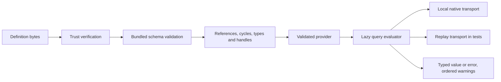

# Architecture and interfaces

The workspace has one definition source (`json/`) and two independent execution
engines (`python/`, `rust/`). Neither engine imports or invokes the other.
Runtime code contains no NVML symbol names, NVIDIA ranges, driver decoding
constants, or SM compatibility rules. The Python legacy facade binds the old
method names to exports from the bundled NVIDIA definition.



## Load and evaluation boundaries

External files require a trusted signature unless the host explicitly opts into
unsigned development loading. In-memory construction (`Provider(definition)` in
Python or `Provider::new` in Rust) is an explicitly trusted host API, not a way
to load untrusted documents. It still performs structural and semantic
validation. Bundled data inherits trust from the installed artifact.

Validation completes before the first library is loaded. Queries evaluate
lazily; opening a provider and generating static catalogs never probes the
machine. Constants, query references, function declarations and diagnostic
references are resolved at validation. Dependency cycles include implicit
`configs` references to feature queries. Static union types reject impossible
operations; data-dependent invalid values still produce runtime errors. Native
handles cannot be fabricated through literal/record tags or exported through
public queries.

Each provider owns its query cache, transport, and diagnostics. Successful
cached results include null. Errors are not cached. Diagnostics accompany
evaluation; reading a cached result does not emit its warnings again. Native
sessions are serialized for the lifetime of a public invocation. Detection uses
`finally` to attempt cleanup before its result is cached. Libraries remain
loaded while their native transport owns them.

## Python

```python
from variant_provider import Provider

provider = Provider()  # bundled NVIDIA definition
outcome = provider.invoke("get_supported_configs")
# {"value": [...], "warnings": [...]} or {"error": {...}, "warnings": [...]}
value = provider.evaluate("get_all_configs")  # raises ProviderError on failure
provider.clear_cache()

external = Provider.from_file(
    "nvidia.json", signature="nvidia.dsse.json", trust=trusted_entries
)
```

The optional `environment` mapping is a mutable test/host injection. Without it,
environment variables are read lazily from the process. `definition` returns a
copy; changes to caller-owned dictionaries cannot bypass initial validation.
`clear_cache(query_name)` can clear one cache entry; omitting it clears all.

`VariantFeatureConfig` has `name: str`, `values: list[str]`, and
`multi_value: bool`. The legacy facade returns these dataclasses, `Version`
objects, and tuples as the reference does. The generic wire representation uses
objects, arrays, and `{"$version": "12.7"}` instead.

## Rust

```rust
let mut provider = variant_provider::Provider::bundled()?;
let outcome = provider.invoke("get_supported_configs");
let value = provider.evaluate("get_all_configs")?;
provider.clear_cache();
```

`Provider::live(definition)` selects native calls.
`Provider::new(definition, transport)` injects a host transport;
`ReplayTransport` supports shared fixtures. `definition()` gives read-only
access. `VariantFeatureConfig` and `Error` are serializable public types. The
generic API returns `serde_json::Value` because provider exports can return
several distinct types.

## Matching CLIs

Both CLIs implement `validate`, `invoke`, `replay`, and `inventory`. `invoke`
accepts comma-separated `--method` names and runs them in one cached instance.
Results are emitted as `{"results": [...]}`. `validate` includes provider
metadata, format/data versions, and exact definition/schema SHA-256 digests. CLI
loading errors exit 2 on stderr; method-level provider errors remain structured
outcomes on stdout. This permits comparisons of intentionally failing methods.

The Python authoring CLI additionally supplies `keygen` and `sign`. There is no
Python extension backed by Rust in this release.
